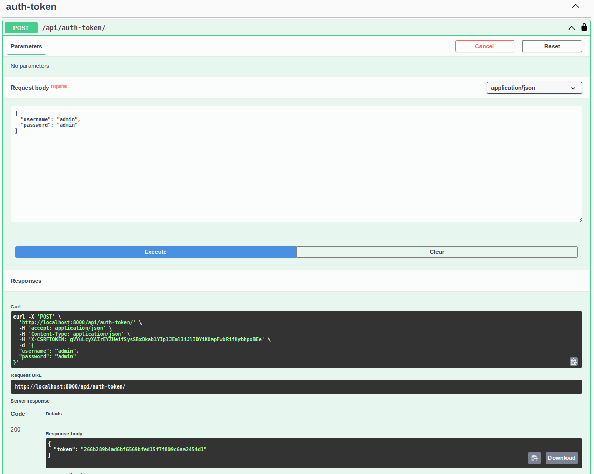
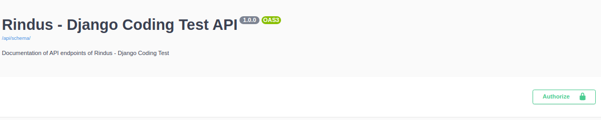
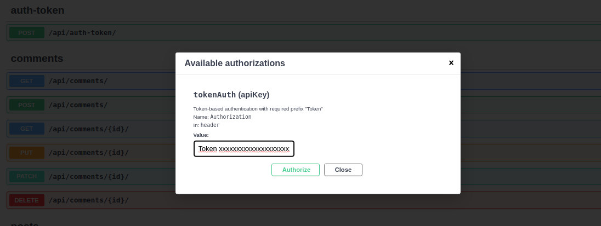

# Rindus - Django Coding Test

Rindus - Django Coding Test

## Task Description

### Description

Create a simple REST API to interact with the Fake API in JSONPlaceholder - Free Fake REST API

* Create a Django command to import the data for the first time (posts and comments only) from JsonPlaceholder Free Fake
  Rest API to the local Postgres.
    * You cannot modify the external provider data structure
    * You can define whatever you want in your local database
* Create a Rest API to manage that data in those models.
* Implement all CRUD operations.
    * The user_id for the new posts created is always 99999942 since we don’t implement the user model.
    * Provide users authentication and request authorization through Bearer Token.
* Synchronize both systems. The system you are implementing is the MASTER. You can decide how and when this
  synchronization will be done. Please write a README to specify how it can be triggered.
* We prefer a tested and well documented task than a quick one.

Technical Requirements

* Use Python 3
* Use Django with Django REST framework
* Use PostgreSQL
* Deliver the task using Docker and docker-compose.

### Tools Used

#### Cookiecutter

Cookiecutter is a project generation tool that uses templates to create repetitive and standardized project structures.
In other words, Cookiecutter allows you to automate the creation of a new project using a pre-designed and
pre-configured template.

This tool was very useful generating all docker configurations.

See detailed information here: [cookiecutter-django documentation](http://cookiecutter-django.readthedocs.io/).

## Basic Commands

### Deployment

- Build the stack

      $ sudo docker-compose -f local.yml build

- Run the stack

      $ docker-compose -f local.yml up -d

- You can check **logs** using commands like this

      $ docker logs -f <container_name>
      $ docker logs -f rindus_coding_test_local_django
      $ docker logs -f rindus_coding_test_local_celeryworker

### Setting Up Your Users

To create a **superuser account**, use this command:

    $ docker-compose -f local.yml run --rm django python manage.py createsuperuser

### Test coverage

To run the tests, check your test coverage, and generate an HTML coverage report:

    $ docker-compose -f local.yml run --rm django coverage run -m pytest
    $ docker-compose -f local.yml run --rm django coverage html
    $ open htmlcov/index.html

#### Running tests with pytest

    $ docker-compose -f local.yml run --rm django pytest

## Exercises Documentation

### Create a Django command to import the data for the first time

To load initial data `load_initial_data` command was deployed.

You can use it like this:

    $ docker-compose -f local.yml run --rm django python manage.py load_initial_data

Additionally `--force` param was implemented to re-load Posts & Comment database information

    $ docker-compose -f local.yml run --rm django python manage.py load_initial_data --force=True

### Create a Rest API to manage that data in those models

This can be accessible through this link:

[http://localhost:8000/api/docs/](http://localhost:8000/api/docs/)

Here you will see a Swagger UI view with all the endpoints (including CRUD elements as expected)

### Provide users authentication and request authorization through Bearer Token

Just use the created superuser in previous section! You can do it through swagger ui

[http://localhost:8000/api/auth-token/](http://localhost:8000/api/auth-token/)

#### Steps

The token will be generated in the Response Body (you can check this in the bottom of the following image)

To login with the generated token, copy it and paste in "Authorize" area (green button on right)

Really important to set "Token ...." prefix before pasting the token and click button "Authorize"

Now you are logged! (Play with the api as much as you want!)

### Synchronize both systems

To do the synchronization tool ´celery´ was used.

First I have generated a new command called "sync_systems" which allows the initialization of the process

    $  docker-compose -f local.yml run --rm django python manage.py sync_systems

What this will do in the background is to invoke an asynchronous task that will take care of the synchronization.

This synchronization will be performed as follows:

1. It will load the querysets of the elements to be updated
2. These querysets will be subdivided into smaller processing elements
3. This allows us to process them asynchronously in different workers in order to achieve the same objective in a
   shorter period of time.

## To be improved!

* Synchronization
  * Django-Signals to sync data in real time (those signals will load tasks to run asynchronous in celery)
* More test! Just made a bunch as example
* Remove unnecessary code generated by Cookicutter:
    * User app was implemented by this tool. This adds non-necessary functionality to the project (views, forms,
      templates, etc.)
    * Production docker-compose configurations like `traefik`
